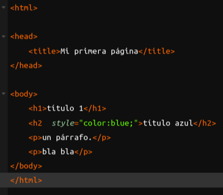
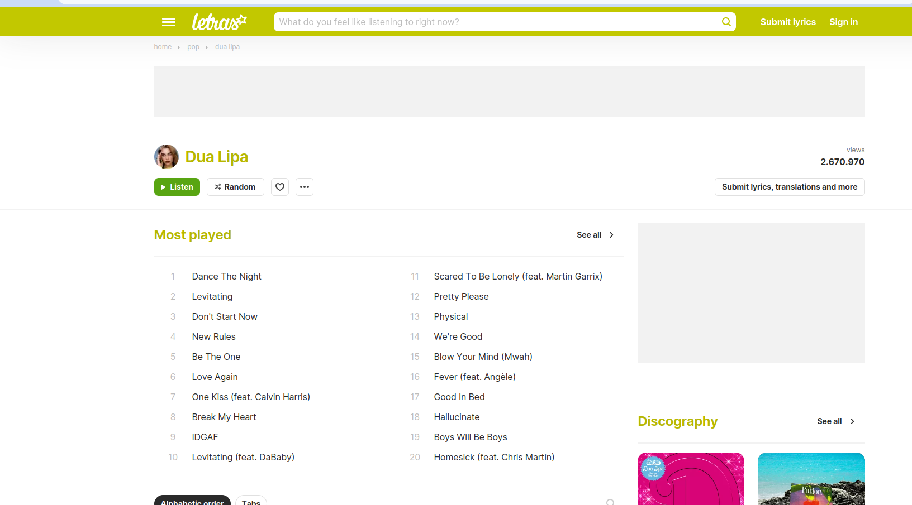
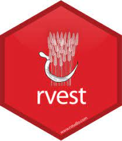

```{r setup, include=FALSE}
options(htmltools.dir.version = FALSE)
knitr::opts_chunk$set(
  fig.retina=3,
  out.width = "70%",
  cache = FALSE,
  echo = T,
  message = FALSE, 
  warning = FALSE,
  hiline = TRUE
)
options(scipen = 999)
```

```{r xaringan-themer, include=FALSE, warning=FALSE}
library(xaringanthemer)
library(tidyverse)
library(DT)
library(kableExtra)
library(plotly)
library(readr)
library(feather)
#style_duo_accent(
#  primary_color = "#1381B0",
#  secondary_color = "#FF961C",
#  inverse_header_color = "#FFFFFF"
#)
xaringanExtra::use_panelset()

```

## Contenidos de la clase

Web scraping con rvest

Web scraping con rselenium

---

## Motivación

#### Internet es una gran fuente de información, pero debemos aprender a extraerla 


.pull-left[

#### Existen métodos para extraer datos de las personas


]

--


.pull-right[

#### Debemos aprender a obtener información de internet

]


---

## Las tecnologías de la web

.center[

]

.pull-left[

**html**: estructura

**css**: apariencia

**javascript**: interacción

]

--

.pull-right[

### Debemos entender lo básico
]

---

## html

Nos dice dónde está la información

.center[

]

---

## Nuestros datos

**www.letras.com**

.center[

]


---

## Nuestros datos

Aprenderemos a extraer letras de canciones

Este es el paso inicial para las clases de NLP

### Usaremos una página estática, para facilitar el aprendizaje 

### Para sitios dinámicos usaremos Selenium

---

## Herramientas

Trabajaremos con rvest del `tidyverse`

```{r, eval=FALSE}
install.packages("rvest")
library(rvest)
```

.center[

]

Nos apoyaremos de una extensión para chrome
- css selector gadget
- https://chrome.google.com/webstore/detail/selectorgadget/mhjhnkcfbdhnjickkkdbjoemdmbfginb


---
class: center, middle

## Métodos Computacionales para las Ciencias Sociales

### Hasta la próxima clase


