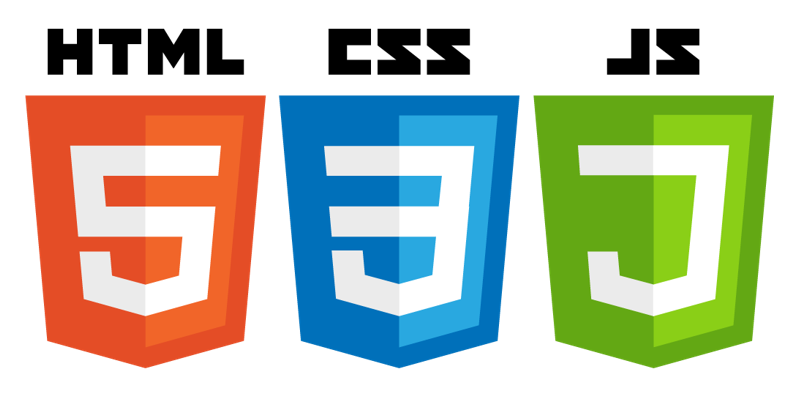
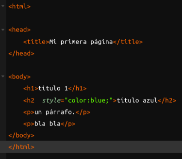
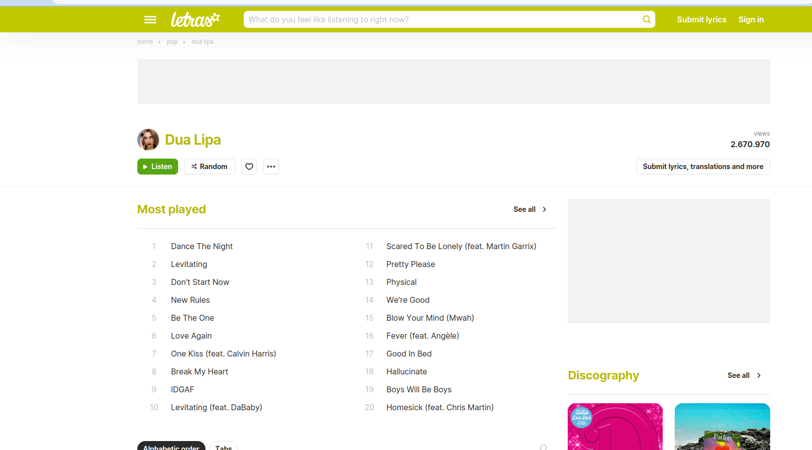
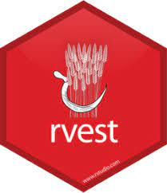

```{r}
source("code/helpers.R", encoding = "utf-8")
```

## Contenidos de la clase

Web scraping con rvest

Web scraping con rselenium


## Produciendo datos

{fig-align="center" width="50%"}

**Cuando no tenemos una API a disposición, web scraping puede ser una opción**


## Produciendo datos

::: columns
::: {.column width="50%"}
#### Existen métodos para extraer datos de las personas


:::

::: {.column width="50%"}
::: fragment
#### Existen métodos para extraer datos de internet

{width="400"}
:::
:::
:::

::: fragment
#### Internet es una gran fuente de información, pero debemos aprender a extraerla
:::

## Las tecnologías de la web

{fig-align="center" width="50%"}

::: columns
::: {.column width="50%"}
**html**: estructura

**css**: apariencia

**javascript**: interacción
:::

::: {.column width="50%"}
::: fragment
### Debemos entender lo básico
:::
:::
:::

## html

Nos dice dónde está la información

{fig-align="center" width="40%"}

[Ejemplo html](https://www.w3schools.com/html/tryit.asp?filename=tryhtml_default)

## css

Le da características a la estructura

{fig-align="center" width="40%"}

[Ejemplo css](https://www.w3schools.com/css/tryit.asp?filename=trycss_default)

## Nuestros datos

[www.letras.com](www.letras.com)

{fig-align="center" width="60%"}

¡Exploremos la página!

## Nuestros datos

Aprenderemos a extraer letras de canciones

. . .

Este es el paso inicial para las clases de NLP

. . .

Usaremos una página estática, para facilitar el aprendizaje

. . .

Para sitios dinámicos usaremos Selenium

## Herramientas

Trabajaremos con [rvest](https://rvest.tidyverse.org/) del [tidyverse](https://www.tidyverse.org/)

```{r, eval=FALSE}
install.packages("rvest")
library(rvest)
```

{fig-align="center" width="15%"}

. . .

Nos apoyaremos con una extensión para chrome

-   css selector gadget
-   https://chrome.google.com/webstore/detail/selectorgadget/mhjhnkcfbdhnjickkkdbjoemdmbfginb

## Antes de seguir...

Debemos extraer la información gentilmente

¡Revisar el archivo robots.txt!

[https://www.letras.com/robots.txt](https://www.letras.com/robots.txt)

. . .

Existe un paquete llamado `polite`, para facilitar el trabajo


## Carguemos nuestro html

```{r, echo=TRUE}
library(rvest)
library(tidyverse)
page <-  read_html("https://www.letras.com/los-prisioneros/") 
print(page)
```

## Obteniendo elementos/nodos

::: panel-tabset
## Seleccionar párrafos

```{r, echo = T}
parrafos <- page %>% 
  html_elements("p") 
print(parrafos)
```

## Extraer texto

```{r, echo = T}
parrafos %>% 
  html_text()

```
:::

# Busquemos letras de canciones {.center background-color="aquamarine"}

## Estrategia

{fig-align="center" width="60%"}

Buscaremos todas las letras de Los Prisioneros

## Estrategia

1.  Entramos a la página de Los Prisioneros

2.  Buscamos los links que llevan a cada letra

3.  Entramos a cada canción

4.  Extraemos la letra de la canción

## Encontrando los links

Entramos a la página que nos interesa

```{r, echo=TRUE}
page <-  read_html("https://www.letras.com/los-prisioneros/") 
```

. . .

Extracción de links

```{r, echo=TRUE}
urls_canciones <- page %>% 
    html_elements(".songList-table-songName") %>% 
    html_attr("href")
print(urls_canciones[1:5])
```

-   **.song-name**: clase del elemento que nos interesa
-   **href**: atributo con la url

## Reconstruyendo la url

Ahora debemos unir la raíz de la url con los identificadores que hemos encontrado

```{r, echo=TRUE}
url_1 <-  paste0("https://www.letras.com",  urls_canciones[1]) 
print(url_1)
```

`r url_1`

## Extraer la letra

Vamos a la nueva url y seleccionamos el elemento que nos interesa

```{r, echo=TRUE}
lyric <-read_html(url_1) %>% 
      html_element(".lyric-original") %>% 
      html_text()
print(lyric)
```

```{r}
letra_prisioneros <- lyric
```

## Obtengamos el título

```{r, echo=TRUE}
title <-read_html(url_1) %>% 
      html_element("h1") %>% 
      html_text()
print(title)

```

## Ejercicio: Doja Cat

Extraer la segunda letra y segundo título de Doja Cat

{fig-align="center" width="50%"}

## Ejercicio: The Clash

**Queremos extraer las 10 primeras letras de los Clash y guardarlas en una lista.**

{fig-align="center" width="40%"}

El *link* inicial para acceder al listado de canciones es:

-   https://www.letras.com/the-clash/

Deberías usar un `for` para lograr el ejercicio

## Ejercicio: Doja Cat y The Clash

Queremos un código que permita extraer las letras de un listado de bandas

. . .

```{r, eval=FALSE, echo=TRUE}
bandas <- c("doja-cat", "the-clash")

letras <- list()
# Para cada banda
for (banda in bandas) {
  
  # Para cada letra de la banda   
  for (letra in letras_banda) {
    # extraer letra de la banda    
    
    # agregar letra a la lista general de letras
    letras = append(letras, letras_banda)
  }
  
   
}

```

## Ordenando el código

::: panel-tabset
## funciones

```{r  , echo=TRUE , `code-line-numbers`="|2-7|11-15"}
# Función para obtener urls
obtener_urls <- function(banda) {
  band_url <-  sprintf("https://www.letras.com/%s", banda)
  urls <-  read_html(band_url) %>% 
      html_elements(".songList-table-songName") %>% 
      html_attr("href")
  return(urls)
}

# Función para extraer letra
extraer_letra <- function(url) {
  lyric <-read_html(url) %>% 
      html_element(".lyric-original") %>% 
      html_text()
  return(lyric)  
}


```

## llamado a funciones

```{r, echo=TRUE, eval=FALSE}
# Raíz de la página
root <- "https://www.letras.com"

# Usar map para crear la lista 
urls <- obtener_urls("the-clash")
full_urls <- paste0(root, urls )
lyrics <-  map(full_urls[1:10], extraer_letra)

```

## todo junto

Podemos unir todo en una función

```{r, eval=FALSE, echo=TRUE, `code-line-numbers`="|1-10|7,9|13,14" }
obtener_letras_banda <- function(banda, n_letras = 5) {

  # Raíz de la página
  root <- "https://www.letras.com"
  
  # Usar map para crear la lista 
  urls <- obtener_urls(banda)
  full_urls <- paste0(root, urls )
  lyrics <-  map(full_urls[1:n_letras], extraer_letra)
  return(lyrics)
}

bandas <- c("doja-cat", "the-clash", "los-prisioneros")
letras <-  map(bandas, obtener_letras_banda)
```
:::

## Último paso

¿Notan algo extraño en la letra de Los Prisioneros?

```{r}
print(letra_prisioneros)
```

## Coming soon...

```{r, echo=TRUE}
fix_string(letra_prisioneros)
```

Esta función sigue teniendo algunos defectos 😲

# ¿Qué pasa con las páginas dinámicas? {.center background-color="aquamarine"}

## Páginas dinámicas

Muchas páginas interesantes van cargando conforme interactuamos con ellas

-   Supermercados
-   Tiendas del *retail*
-   Portales de empleo
-   Diarios
-   etc.

. . .

Veamos algunos ejemplos

## Problemas de investigación

Dinámicas del mercado laboral

. . .

Monitoreo de precios para IPC

. . .

Análisis de prensa escrita

## Selenium

Selenium nos permite automatizar la interacción con los navegadores

. . .

Tendremos que usar tecnologías que están fuera de `R`

- Selenium
- Docker
- Java

. . .

Revisaremos algunos usos más avanzados, para quienes estén interesados

. . .

Solo haremos una demostración. Si quieren profundizar, pueden seguir estas documentaciones

- [Documentación 1](https://docs.ropensci.org/RSelenium/articles/basics.html) 
- [Documentación 2](https://docs.ropensci.org/RSelenium/articles/docker.html)


## Instalación

```{r, eval=FALSE, echo=T}
install.packages("Rselenium")
```

Además, deben tener instalado Selenium en un contenedor o localmente 

## Seteo inicial

En linux o macOS, podemos hacer andar Selenium desde la línea de comandos

```{r correr selenium, eval=FALSE, echo=T}

system("docker run -d -p 4445:4444 -p 5901:5900 --name selenium selenium/standalone-firefox-debug:2.53.0")

```

Nos conectamos al servicio que acabamos de hacer andar


```{r, eval=TRUE, message=FALSE, echo=T, warning=FALSE}
library(RSelenium)
remDr <- remoteDriver(
  remoteServerAddr = "localhost",
  port = 4445,
  browserName = "firefox"
)

remDr$open(silent = FALSE)
```

## Explorar páginas

Página de la BBC

```{r, echo=TRUE}
remDr$navigate("http://www.bbc.com")
remDr$getTitle()
```

. . . 

Ahora nos vamos a emol

```{r, echo=TRUE}
remDr$navigate("http://emol.com")
remDr$getTitle()

```

## Buscando elementos

Extraer los elementos "a"

```{r, echo=TRUE}
a_elements <- remDr$findElements(using = "css", value = "a")
length(a_elements)
```

. . .

Para extraer el texto de uno de los elementos usamos `getElementText`

```{r, echo=TRUE}
a_elements[[1]]$getElementText()
```

## Explorando el texto de los elementos

Miremos algunos de los textos contenidos en la lista

```{r}
for (text in a_elements[1:5])
  {
    print(text$getElementText())
  }
```

## Explorando el texto de los elementos

Guardemos todo en una lista y construyamos un *dataframe*

```{r}
textos <- map(a_elements, ~.x$getElementText()[[1]] )
data.frame(text = unlist(textos)) |> 
  filter(text != "") |> 
  DT::datatable()


```

## ¿Interactuar con la página?

Primero, entramos a la máquina virtual que contiene el servicio

```{r, eval=F, echo=TRUE}

# Página inicial de la BBC
remDr$navigate("https://www.bbc.com")

# Encontrar el botón de noticias
news <- remDr$findElement(using = "css", value = "#__next > div > nav > section > nav > ul > li:nth-child(2) > div > a")

# Hacer click
news$clickElement()

# Página inicial de BBC
remDr$navigate("http://www.bbc.com")

# Encontrar el botón de deportes
deportes <- remDr$findElement(using = "css", value = "#__next > div > nav > section > nav > ul > li:nth-child(3) > div > a")

# Clickear en botón de deportes
deportes$clickElement()


```


## A tener en cuenta

```{r, eval=F, echo=TRUE}
remDr$navigate("https://www.lider.cl/inicio")
input  <- remDr$findElements(using = "css", value = ".b--none")

input[[2]]$sendKeysToElement(list("papas fritas", key = "enter"))


```

Hay sitios que detectan el uso de navegación automática

## Para finalizar

Es conveniente cerrar nuestra conexión

```{r, echo=TRUE}
remDr$close()
```

. . .

- El *web scraping* es muy útil para el mundo profesional y académico

- Nos da acceso a fuentes masivas de información (especialmente texto)

- Es un trabajo de artesanía que requiere paciencia y dedicación

- Tiene un costo de mantenimiento, que requiere ser evaluado en proyectos largos


# Métodos computacionales para las ciencias sociales  {.center background-color="aquamarine"}


